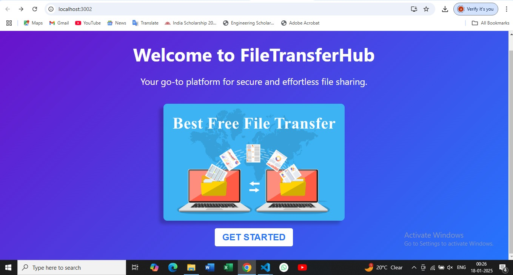
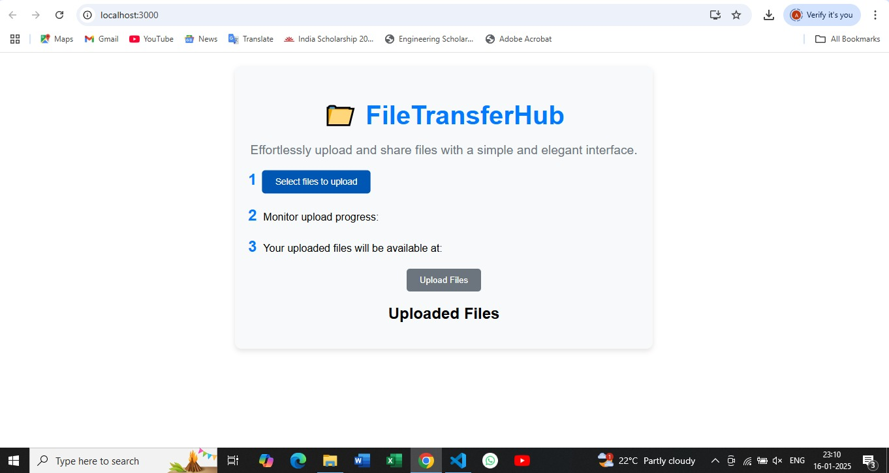
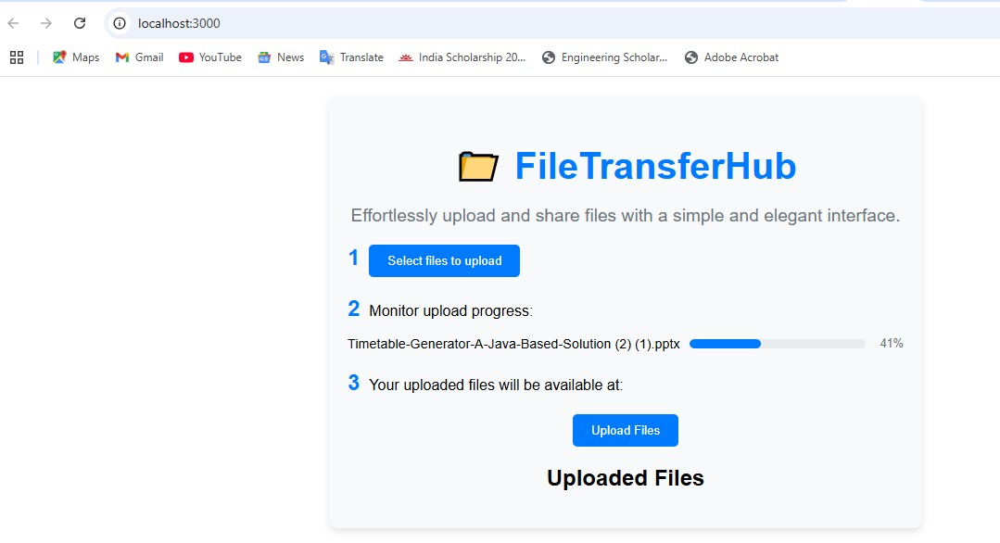
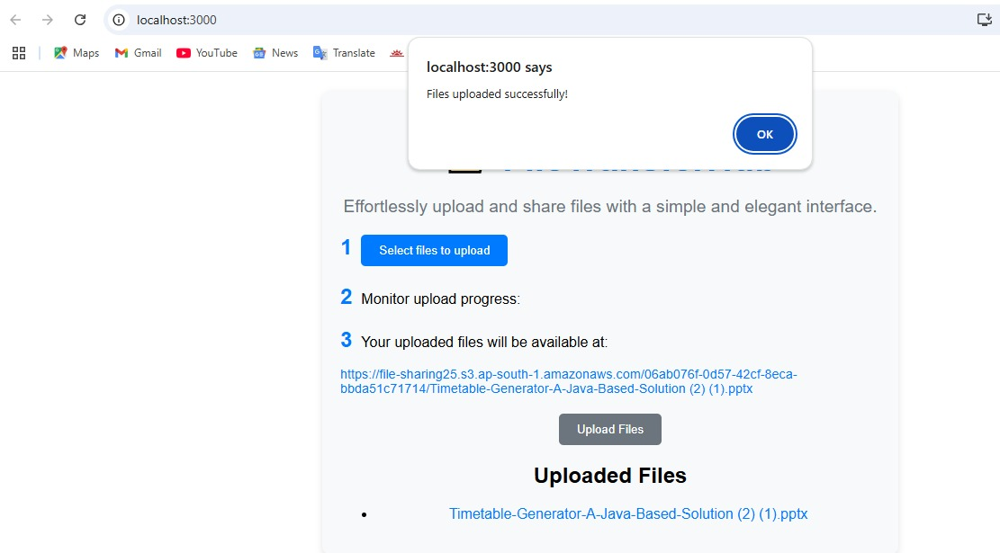
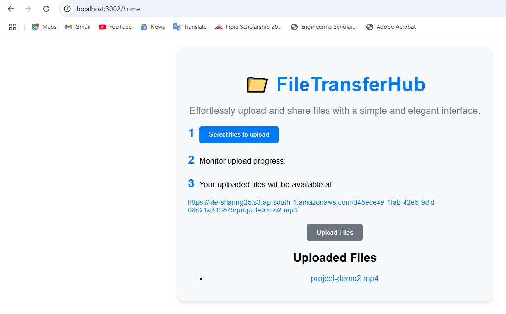

# File-sharing-WebApp
"Just started to built a small and simple, open-source file-sharing app! 🚀 Upload files, get a shareable link, and let the app handle auto-deletion after 6 days. No registration needed! 🔗 #WebDevelopment #OpenSource #ReactJS #NodeJS #AWS #clouds"

## Preview

### Intro page

### Home page

### progressbar

### uploaded File

### Getlink

=======
## Demo

### Watch the Video
[Watch the demo](https://file-sharing25.s3.ap-south-1.amazonaws.com/d45ece4e-1fab-42e5-9dfd-08c21a315875/project-demo2.mp4)

